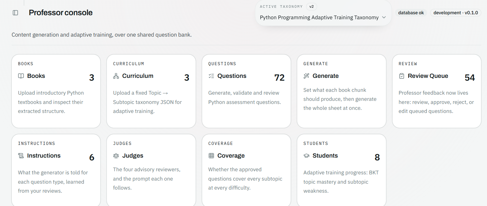
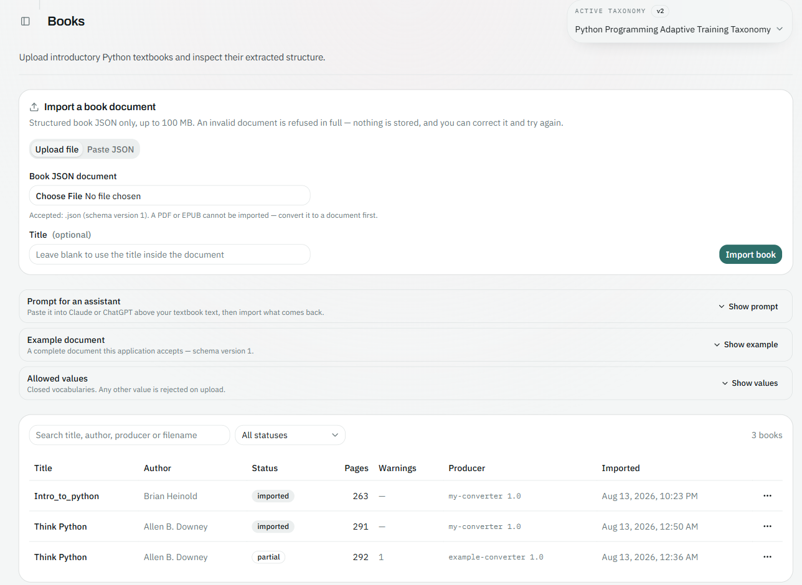
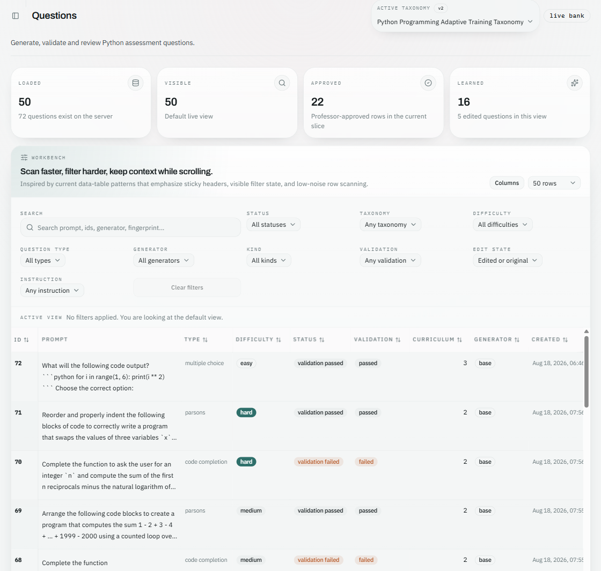
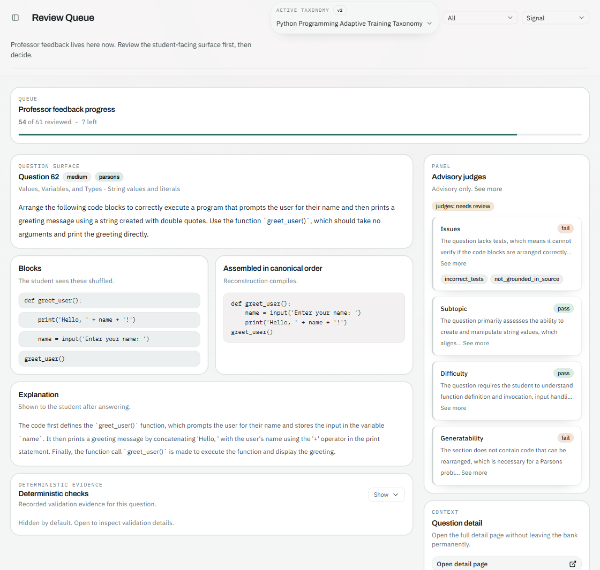
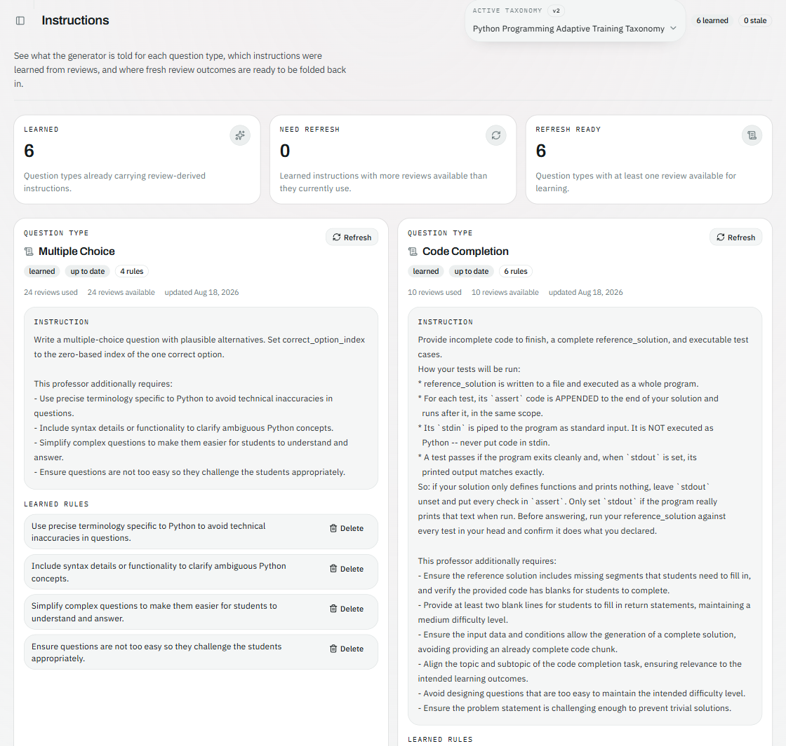
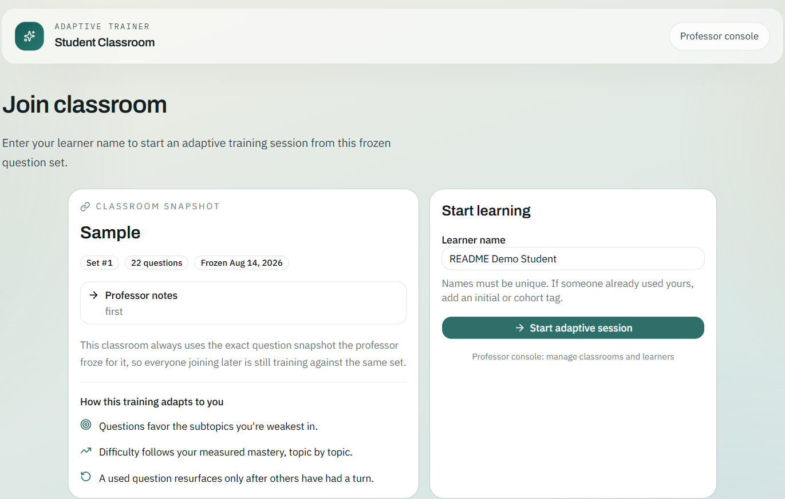
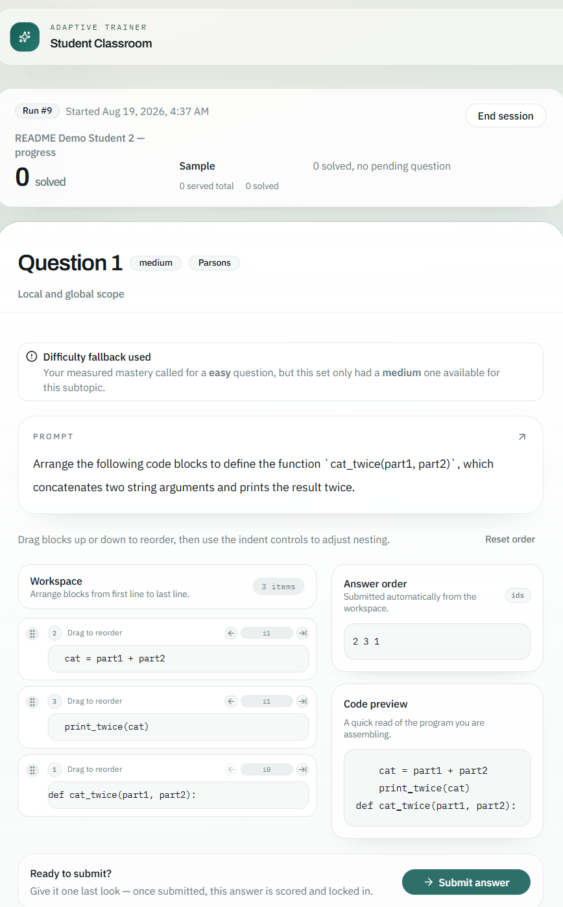
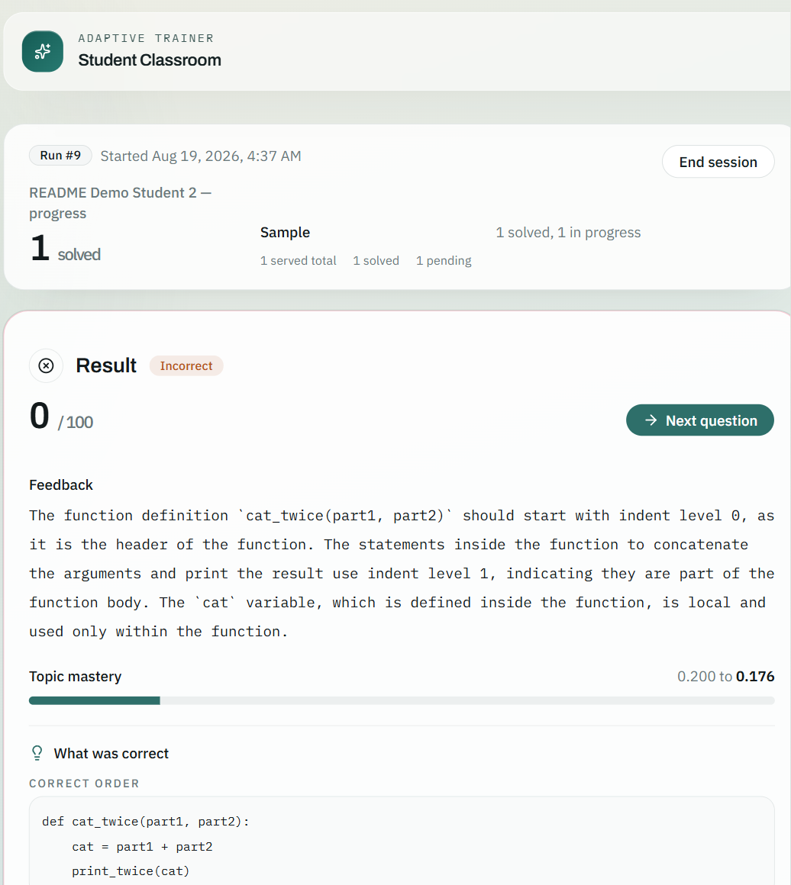

# UAT (Universal Adaptive Trainer)

UAT is an adaptive learning platform that turns source material into personalized practice.

Upload books, generate questions from the material, evaluate those questions with custom rules and automatically generated judges, and use the resulting bank inside an adaptive teaching loop for students.

The core idea is to connect four pieces that are usually scattered across separate tools:

- content ingestion from real course material
- question generation and feedback-driven refinement
- automated evaluation and judge generation
- adaptive delivery based on student performance

## What UAT Does

- Ingests structured books with chapter, section, and provenance metadata
- Builds a versioned curriculum and question bank on top of that material
- Generates personalized questions from selected content chunks
- Runs deterministic checks and LLM-based evaluation over generated output
- Learns from review feedback to improve future generation behavior
- Freezes evaluated questions into stable sets for student delivery
- Runs adaptive training sessions using topic mastery and subtopic weakness

## Technical Highlights

- FastAPI backend with explicit domain boundaries, typed schemas, and repository-backed persistence
- Next.js professor console over a typed API surface
- Structured LLM integration for generation, evaluation, and learned instructions
- Custom evaluation pipeline with reusable judges and batch re-evaluation support
- Adaptive engine using BKT topic mastery, subtopic weakness, and question-priority rotation
- Strong automated coverage across backend logic, API behavior, and frontend units

## Stack

- Backend: Python, FastAPI, SQLAlchemy, Pydantic
- Frontend: Next.js, React, TypeScript, TanStack Query
- LLM layer: OpenRouter-compatible structured calls
- Tooling: pytest, Ruff, Biome, Vitest, Docker Compose

## Quickstart

### Local

```powershell
py -3.12 -m venv .venv
.\.venv\Scripts\python.exe -m pip install -e ".[dev]"
Copy-Item .env.example .env

cd frontend
pnpm install
cd ..

# terminal 1
.\.venv\Scripts\python.exe -m app

# terminal 2
cd frontend
pnpm run dev
```

- App: [http://localhost:3000](http://localhost:3000)
- API docs: [http://127.0.0.1:8000/docs](http://127.0.0.1:8000/docs)

### Docker

```powershell
docker compose up --build
```

- App: [http://localhost:3000](http://localhost:3000)
- API docs: [http://localhost:8000/docs](http://localhost:8000/docs)

## Screenshots

### Professor console

The console is organized around one pipeline: ingest content, build a curriculum, generate questions against it, evaluate what came back, then freeze a set for students.



**Books** — upload structured book documents and track what has been imported, including partial imports with warnings.



**Questions** — a filterable workbench over the whole question bank: status, difficulty, taxonomy, generator, validation outcome, and edit history.



**Review queue** — the professor-facing review loop. Each question shows the student-facing surface next to its deterministic checks and the verdicts from four advisory judges (issues, subtopic fit, difficulty, generatability).



**Instructions** — what the generator is told for each question type, plus the rules it has learned from professor review feedback over time.



### Student experience

Students join a frozen question set with just a name — no account needed.



Training questions (multiple choice, Parsons, code completion) are served adaptively, favoring a student's weakest subtopics.



Each answer updates topic mastery in real time (BKT-based) and feeds back into what gets served next.



## Documentation

- Local development: [docs/LOCAL_DEVELOPMENT.md](docs/LOCAL_DEVELOPMENT.md)
